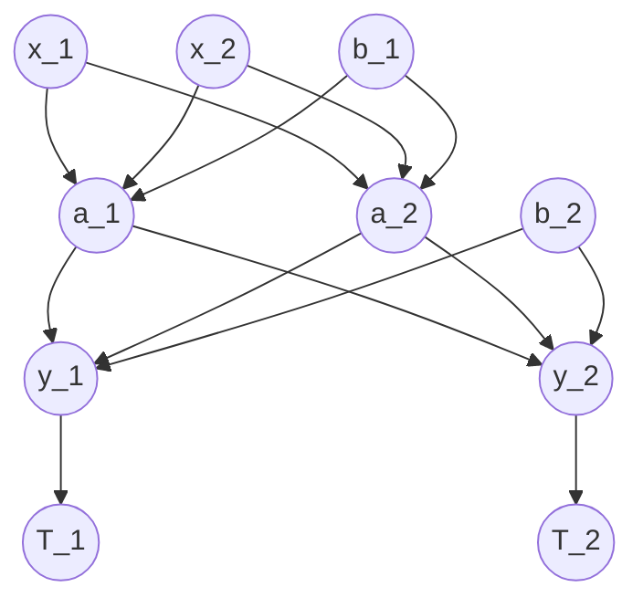

> [!NOTE] ELI5: **[[Multilayer Perceptron (MLP)]]**
> Multilayer feedforward neural network. this special type of **FULLY** connected network is also called [[Multilayer Perceptron (MLP)]]
> 
> **if more than one hidden layer** (i.e. *number of total layers > 3*) then we call it **Deep artificial neural network**
> ![[image_Multilayer Perceptron (MLP).png]]


# Overview
![[image_Multilayer Perceptron (MLP)-1.png]]


> [!NOTE] **the MLP learning procedure in 3 steps:**
> 1. Starting at the input layer, we **forward propagate the patterns of the training data through the network to generate an putput.**
> 2. Based on the network's output, we calculate the error that we want to minimize using a cost function that we will describe late (\_\_\_\_\_\_)
> 3. We back propagate the error, find its derivative with respect to each weight in the network, and update the model.

## More one the workings of the network


> [!quote] Diagram notes
> - from top to bottom, layers 1-3: *input layer*, *hidden layer*, *output larer*
> - **b_1 & b_2:** biases
> - **x_1 & x_2:** input values
> - **w_1, w_2..:** weights (*the arrows*)


> [!NOTE] Math shit
> (**Pilene, der går fra de enkelte nodes/neurons hedder $w_{n}$.**) 
> F.eks.: ($x_{1}:w_{1}\to a_{1}, w_{3} \to a_{2}$ )($x_{2}:w_{2}\to a_{1}, w_{4} \to a_{2}$ ) **ikke notationer, bare til forklaring!**
> - Use $x_{n}$ and $w_{n(x)}+b_{1}$ to calculate $a_{n}$, repeat, moving deeper into the layers, until we get $y_{n}$
> 
> $$x_{1}*w_{1}+x_{2}*w_{2}+b_{1}=a_{1}$$
> $$a_{1}w_{5}+a_{2}w_{6}+b_{2}=z_{1}\text{ (?? idk what)}$$
> $$y_{1}=\frac{1}{1+e^{-z_{1}}}$$
> - **then, compare to targets** ($T_{1}=0.01$ *SOME ARBITRARY NUMBER **(REMEMBER: TARGET)**.*)
> 	- Calculate error with chosen error function (*we use error to update the weights*)
> - **Update the weights!**(backpropagation?): formel for weight updates afhænger af metodevalg (step function etc.)
> 	- Start med seneste weights (**tættest på out / dybest... altså** $b_{n},b_{n-1},\dots,b_{1}$)
> - **==USE THE CHAIN RULE!!!!==** something about integrals or some shit (den afledede funktion. $\frac{df}{dx}$)
> - **When to stop?**
> 	- if you're spot on(???)
> 	- reach # of iteration threshold
> 	- or error-val is less than

## Activation neural network via forward propagation
**Step 1:** calculating the activation unit of the hidden layer $a_{1}^{h}$ as follows:
$$z_{1}^{(h)} = a_{0}^{(in)}w_{0,1}^{(h)}+a{1}^{(in)}w_{1,1}^{(h)}+\dots+a_{m}^{(in)}w_{m,1}^{(h)}$$ $$ø(z)=\frac{1}{1+e^{-z}}$$

# ## Parallelizing [[Multilayer Perceptron (MLP)|Multilayer Artificial Neural Networks]] training with TensorFlow
By default, Python is limited to execution on one CPU core due to **GIL (Global Interpreter Lock)**
**Soultion:** Use GPUs!! (and this is where TensorFlow enters the picture.)

> [!NOTE] **TensorFlow**
> A programming interface for implementing and running ML algorithms. Allows execution on both CPU & GPU, though more benefits from using GPU.
> 
> $z=w\times x+b$
> 
> **Features:** + Scalable, + multi-language(agnostic) + Convenience wrappers
> 
> *Supports CUDA GPUs*
> 

**TensorFlow** is built around a computation graph composed of a set of nodes. Each node represents an operation that may have zero or more input or output. The values the flow through the edges of the computations graph are called tensors

> [!NOTE] **CUDA** (NVIDIA)
> Parallel computing platform and programming model **for general computing on GPUs** (i.e. *Use GPUs for CPU shit, instead of letting them sit idly and do nothing*)


#### Coffee Roasting example
##### Pic 1
![[ML n AI written Notes-1.png]]
##### Pic 2
```Python
x = np.array([[200.0, 17.0]])
layer_1 = Dense(units=3, activation='sigmoid')
a1 = layer_1(x)
```
![[ML n AI written Notes-2.png]]
##### Pic 3
```Python
x = np.array([[200.0, 17.0]])
layer_1 = Dense(units=3, activation='sigmoid')
a1 = layer_1(x)

# Her kommer den vigtige del
layer_2 = Dense(units=1, activation='sigmoid')
a2 = layer_2(a1)
```
![[ML n AI written Notes-4.png]]
##### Pic 4
```Python
if a2 >= 0.5:
	y_hat = 1
else:
	y_hat = 0
```
![[ML n AI written Notes-5.png]]
##### Pic 1